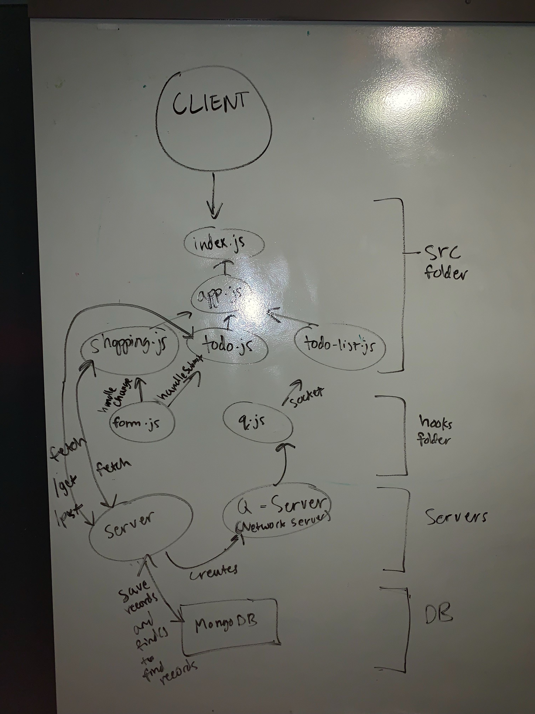

# LAB - 31/32 Hooks API + Custom Hooks: Sockets and Fetch

## Authors: Pratiibh Bassi

## Links and Resources
* [submission Pull Request](https://github.com/pratiibh-401-advanced-javascript/lab-32/pull/1)
* [Netlify Deployment](https://naughty-heisenberg-f81ef4.netlify.com/)

## Modules
### `index.js` - main entry point
### `app.js` - imports in the following files
* #### `shopping.js` uses hooks from form.js to fetch 
* #### `todo.js`
* #### `todo-list.js` - imports the following file to create unordered list for our data
    * ##### `q.js` - Q server maintains pub/sub pattern and q.js connects to it
### `form.js` - the hooks (handleChange + handleSubmit)

## Exported Values and Methods

### form.js

* ### `handleChange(event) -> string` - takes valid input (task, category, date) and updates it to reflect what the user wants

* ### `handleSubmit(event) -> handles the values/field changed from handleChange` 

### shopping.js, todo.js

* ### `saveFormDataToServer(data) -> fetches the POST from API ` 

## Setup
### `.env` requirements
* `REACT_APP_Q_SERVER` - sockets
* `REACT_APP_API` - API

## Running the app 
* `npm start`

## Endpoints:
* ### https://q-js401.herokuapp.com
* ### https://api-js401.herokuapp.com/api/v1/todo

#### Tests
* Tests not required

#### UML

